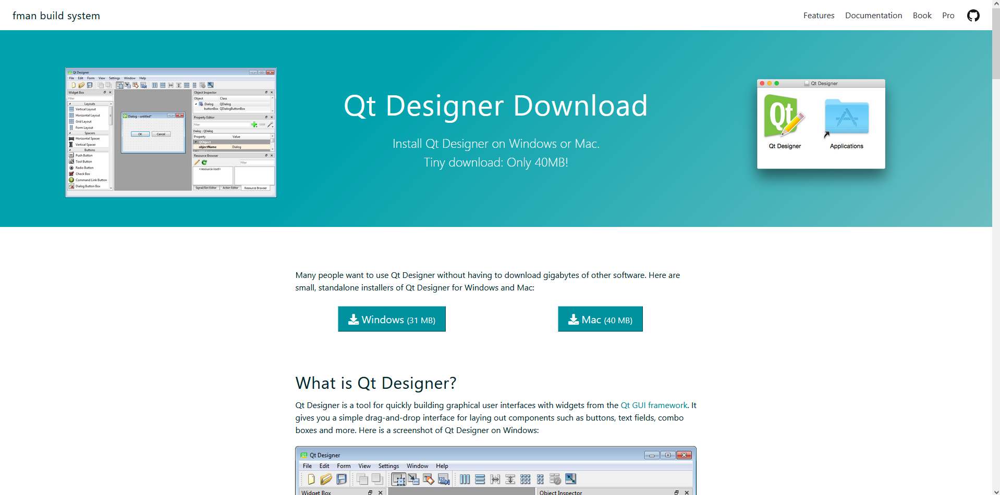
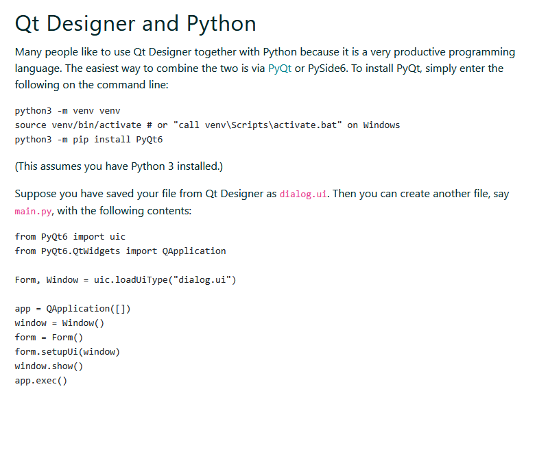
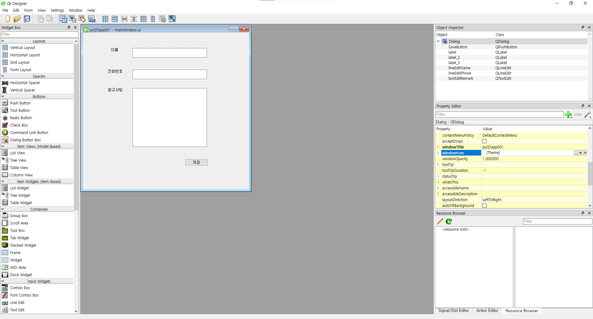
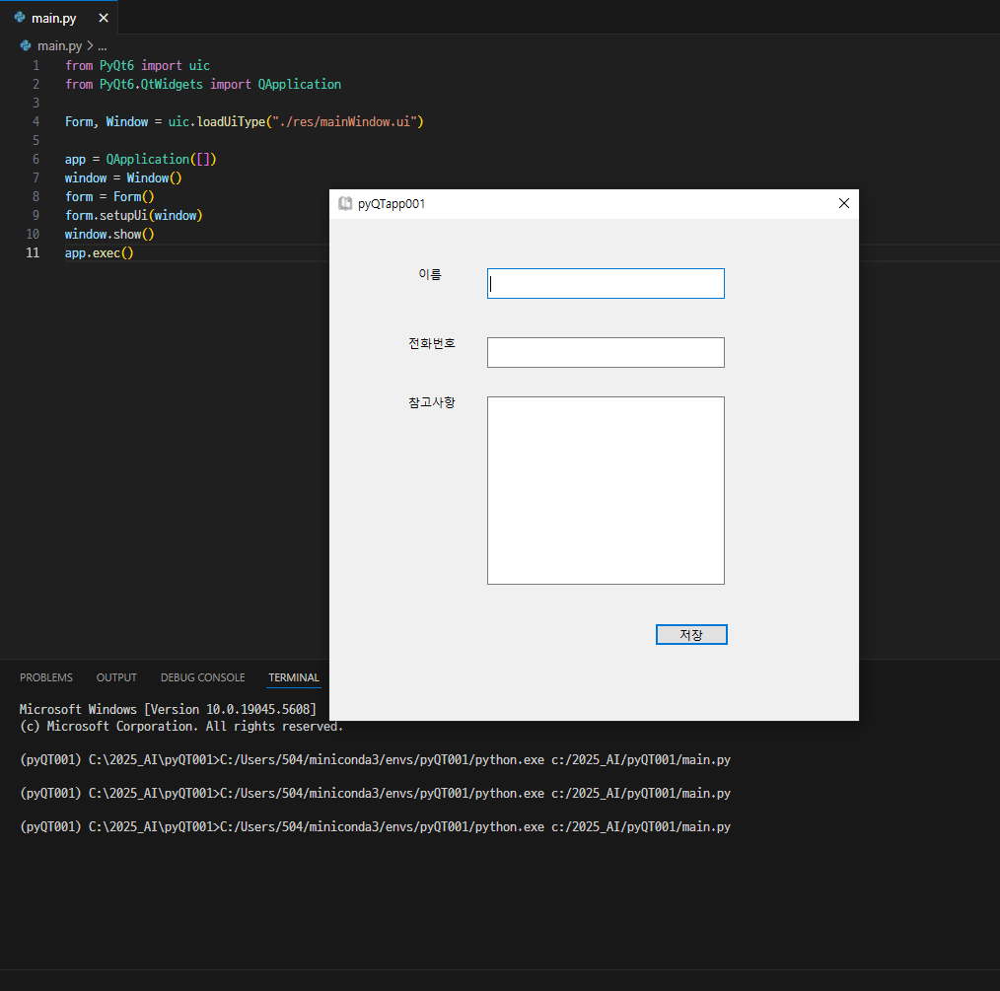

# QT_Designer
## QT_Designer를 이용해 직접적으로 코드를 짜지 않아도 GUI를 만들어 보았습니다.

## 1. 구글에 QT Designer를 검색해 다운드로드

## 2. PyQt06 다운, .ui 파일을 불러와 실행시켜주는 파이썬 파일(main.py) 만들기
### 2.1 conda를 이용해 가상환경을 만든 후 pip install PyQt06 입력

### 2.2 main.py 파일 만들기

## 3. QT Desinger를 이용해 UI 만들기

## 4. main.py 코드를 .ui 파일 위치를 지정해준 후 실행

