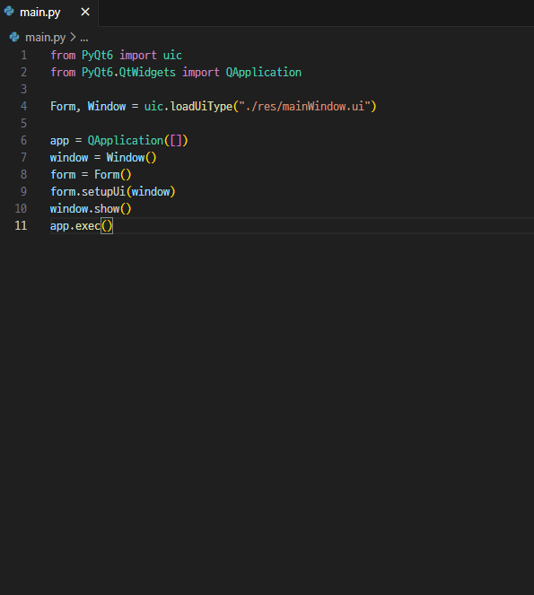

# QT_Designer
## QT_Designer를 이용해 직접적으로 코드를 짜지 않아도 GUI를 만들어 보았습니다.

## 1. 구글에 QT Designer를 검색해 다운드로드

## 2. PyQt06 다운, .ui 파일을 불러와 실행시켜주는 파이썬 파일(main.py) 만들기
### 2.1 conda를 이용해 가상환경을 만든 후 pip install PyQt06 입력

### 2.2 main.py 파일 만들기

## 3. QT Desinger를 이용해 UI 만들기
### 3.1 이와 같이 프리뷰 기능을 이용해 직접 코딩을 하지 않고도 ui 제작 가능

## 4. main.py 파일 실행전 .ui 파일 저장 위치를 지정해준 후 실행

## 5. 저장 버튼을 누르면 csv 파일에 저장하는 기능 추가

'''import csv
from PyQt6 import uic
from PyQt6.QtWidgets import QApplication, QMainWindow, QMessageBox

class MainWindow(QMainWindow):
    def __init__(self):
        super().__init__()
        # UI 파일 로드
        self.form, self.window = uic.loadUiType("./res/mainWindow.ui")
        self.ui = self.form()
        self.ui.setupUi(self)

        # SaveButton 클릭 이벤트 연결
        self.ui.SaveButton.clicked.connect(self.save_data)

    def save_data(self):
        # 입력 필드에서 데이터 가져오기
        name = self.ui.lineEditName.text().strip()  # QLineEdit에서 텍스트 가져오기
        phone = self.ui.lineEditPhone.text().strip()
        note = self.ui.textEditRemark.toPlainText().strip()  # QTextEdit에서 텍스트 가져오기

        # 입력값 검증
        if not name:
            QMessageBox.warning(self, "Validation Error", "이름을 입력하세요.")
            return
        if not phone.isdigit() or len(phone) < 10:
            QMessageBox.warning(self, "Validation Error", "전화번호는 숫자로만 이루어져야 하며 최소 10자리여야 합니다.")
            return
        if len(note) > 200:
            QMessageBox.warning(self, "Validation Error", "참고사항은 200자를 초과할 수 없습니다.")
            return

        # 데이터 저장 (CSV 파일에 추가)
        try:
            with open("db.csv", "a", newline="", encoding="utf-8") as csvfile:
                writer = csv.writer(csvfile)
                writer.writerow([name, phone, note])  # 데이터를 한 줄로 추가
            QMessageBox.information(self, "Success", "데이터가 'db.csv' 파일에 성공적으로 저장되었습니다!")
        except Exception as e:
            QMessageBox.critical(self, "Error", f"데이터 저장에 실패했습니다: {e}")

if __name__ == "__main__":
    app = QApplication([])
    main_window = MainWindow()
    main_window.show()
    app.exec()
'''
